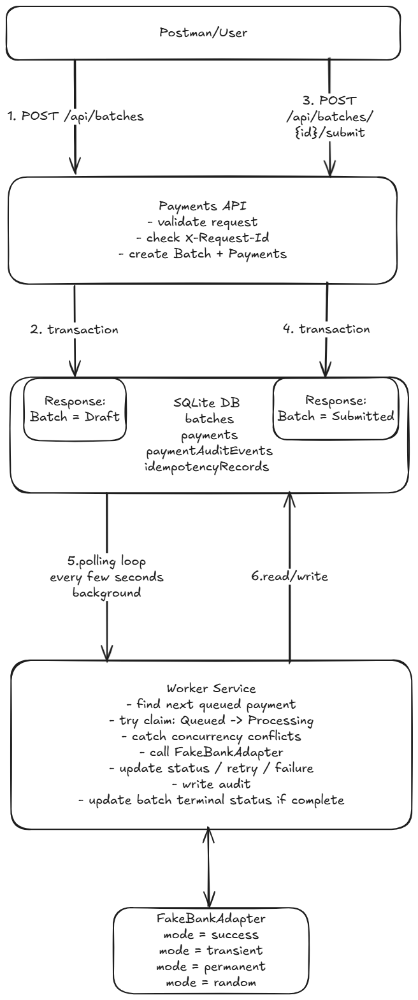
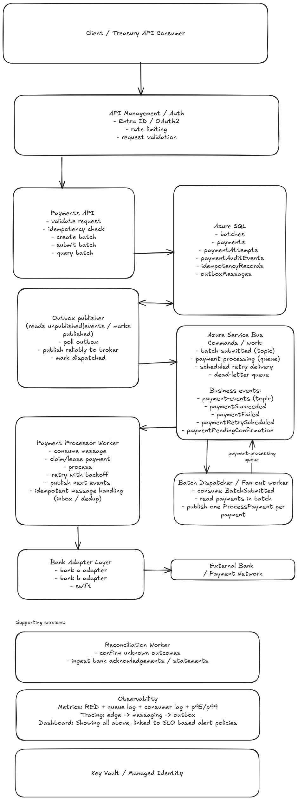

# Payment Batch Processing Service — Design Document

## Problem statement

Corporate treasury teams need to submit and process batches of outbound payments safely and efficiently. Existing workflows are often manual, fragile, and error-prone. This system provides the core batch processing path with a focus on:

- correctness
- auditability
- resilience
- clear evolution to production

---

## Scope

### Implemented
- Create batch
- Submit batch
- Asynchronous payment processing via worker
- Transient and permanent failure handling
- Idempotent batch creation
- Batch and payment query endpoints
- Audit events for state transitions

### Deferred (documented for production)
- Authentication and authorization
- Real bank integrations
- Reconciliation for unknown outcomes
- Approval workflows
- Event-driven dispatch (Service Bus + outbox)
- Multi-tenant isolation

---

## Architecture overview

The system is implemented as a **modular monolith** composed of:

- API (HTTP boundary)
- Application (use-case orchestration)
- Domain (business rules and state transitions)
- Infrastructure (database, adapters)
- Worker (asynchronous processing)

### Key principles

- **Payment-level execution**: each payment is processed independently to isolate failures.
- **Batch as orchestration**: batch tracks lifecycle but does not block execution.
- **Relational storage first**: for transactional safety and auditability.
- **Async processing**: API remains responsive while work is handled in the background.

---

## Batch lifecycle

The API separates creation from execution:

- `Create batch` → persists a draft (`Draft`)
- `Submit batch` → transitions to `Submitted` and releases payments (`Queued`)

This enables:
- validation before execution
- idempotent creation
- clearer control of lifecycle

---

## Data model

### Batch
- Id
- ClientBatchReference
- Status (`Draft`, `Submitted`, `Processing`, `Completed`, `CompletedWithFailures`)
- CreatedAtUtc
- SubmittedAtUtc

### Payment
- Id
- BatchId
- ClientPaymentReference
- Currency
- Amount (decimal)
- BeneficiaryName
- DestinationAccount
- Status (`Pending`, `Queued`, `Processing`, `Succeeded`, `Failed`, `RetryScheduled`)
- FailureCode
- FailureReason
- AttemptCount
- LastAttemptAtUtc
- RetryAfterUtc
- Version

### PaymentAuditEvent
- Id
- PaymentId
- OldStatus
- NewStatus
- OccurredAtUtc
- Reason
- CorrelationId

### IdempotencyRecord
- Id
- RequestId
- ResourceType
- ResourceId
- CreatedAtUtc

### Notes
- Monetary values use **decimal** to avoid floating-point errors
- Data model is relational to support audit queries and consistency
- Data layer is abstracted so SQLite can be swapped for Azure SQL

---

## Concurrency and consistency

The system uses **atomic local state transitions**, not a single end-to-end transaction.

### API layer
- Create and submit operations are executed in a single DB transaction
- Idempotency prevents duplicate batch creation

### Worker processing
Split into two transactions:

1. Claim payment  
   `Queued → Processing` (atomic, prevents duplicate processing)

2. Persist result  
   `Processing → terminal state` (atomic)

External bank calls occur **outside** any DB transaction.

### Guarantees
- Only one worker can claim a payment
- Batch completion is **eventually consistent**
- System is resilient to retries and duplicate execution

---

## Failure handling

### Types of failures

- **Validation errors** → rejected synchronously
- **Transient failures** → `RetryScheduled`, then retried with backoff
- **Permanent failures** → `Failed`
- **Worker crashes** → stale `Processing` records re-queued

### Partial failures

Batches are not all-or-nothing:

- All succeed → `Completed`
- Mixed outcomes → `CompletedWithFailures`

Clients can inspect both batch-level and payment-level status.

### Unknown outcomes (future)

If a bank call times out or returns an ambiguous result:

- Payment transitions to `PendingConfirmation`
- A reconciliation process resolves final state later

---

## Observability and operations

Basic observability exists locally, full operational monitoring is future/production work.

### Logging
- Structured logs with:
  - batchId
  - paymentId
  - requestId
  - correlationId
  - attempt count

### Metrics (future)
- request rate, latency, errors (RED)
- queue lag / processing lag
- success / failure / retry rates
- p95 / p99 latency

### Tracing
- end-to-end tracing:
  - API → DB → worker → external bank

### Monitoring
- dashboards + SLO-based alerts
- DLQ monitoring
- retry spikes detection

---

## Current topology (implementation)

- API writes to SQLite
- Worker polls DB for `Queued` payments
- Worker claims, processes, and updates state
- Fake bank adapter simulates responses

### Trade-offs (current)

**Pros**
- Simple to run locally (one command)
- Minimal infrastructure
- Easy to understand and debug

**Cons**
- DB used as work queue
- Polling introduces latency and inefficiency
- Limited scalability
- Not production-grade dispatch model

---

## Future topology (production direction)

Event-driven architecture using:

- Azure SQL (system of record)
- Outbox pattern for reliable event publishing
- Azure Service Bus for async processing
- Batch Dispatcher (fan-out)
- Payment Processor Workers
- Reconciliation Worker

### Flow

1. API writes batch + payments + outbox event (transaction)
2. Outbox publisher emits `BatchSubmitted`
3. Batch Dispatcher fans out `ProcessPayment` messages
4. Workers process payments independently
5. Workers publish payment result events
6. Batch Aggregator derives batch status
7. Reconciliation resolves unknown outcomes

---

## Production path on Azure

- API → Azure Container Apps
- Worker → Azure Container Apps
- Database → Azure SQL
- Messaging → Azure Service Bus
- Observability → Application Insights
- Secrets → Key Vault + Managed Identity
- Edge → API Management + Entra ID

---

## Trade-offs

### 1. Modular monolith vs microservices
- Chosen: modular monolith
- Reason: reduces operational overhead, faster iteration
- Trade-off: less independent scaling initially

### 2. Polling vs event-driven
- Chosen (current): polling
- Future: Service Bus
- Trade-off: simplicity now vs scalability later

### 3. Relational DB vs NoSQL
- Chosen: relational
- Reason: strong consistency, auditability
- Trade-off: less flexible scaling than distributed stores

### 4. Payment-level vs batch-level processing
- Chosen: payment-level
- Reason: isolates failures, enables parallelism
- Trade-off: more coordination needed for batch status

### 5. Atomic transitions vs distributed transactions
- Chosen: atomic state transitions
- Reason: external systems prevent true global transactions
- Trade-off: requires reconciliation and eventual consistency

---

## Authentication (future)

- API secured via Entra ID (OAuth2)
- API Management enforces policies and rate limiting
- Internal services use managed identities

---

## Disaster Recovery (future)

The current implementation does not include full disaster recovery capabilities, as it is designed for local execution and demonstration. In production, the system would adopt a cloud-native resilience and disaster recovery strategy aligned with Azure best practices.

---

## Next steps

- Replace polling with Service Bus + outbox pattern
- Implement reconciliation for unknown outcomes
- Add approval workflows for batch submission
- Introduce business-level metrics and alerting
- Expand bank adapter layer with real integrations
- Add tenant isolation model

## System Topology

### Current Topology

### Future Topology

